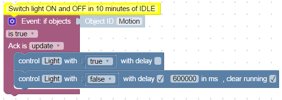

# Description
Blockly is a visual editor that allows users to write programs by adding blocks together. 
It is designed for people with no prior experience with computer programming. 

# Getting started

## Sample 1
**Control state on change of some other state**


This is the classical rule to switch something ON or OFF on other event.

Here the light will be switched on or off if the motion was detected or motion detector sends IDLE state.

First of all insert block "Triggers=>Event: if object". Select object ID to use this state as trigger for rule.

Add to trigger other block - "System=>Control" and select in dialog other state that must be controlled by event.

Insert into control block the "System=>Get value of state" block and select in dialog the "Motion" object to write the value of this state into "Light"*[]: 
 
There is a special variable **value"" in trigger block. It is always defined there and you can use this variable for your need. It consist actual value of triggered state and you can create simpler rule by using "Variable=>item" block and renaming it into "value".


```
<xml xmlns="http://www.w3.org/1999/xhtml">
  <block type="comment" id="s7s**k+Cc_KjDnJW`(h~" x="12" y="63">
    <field name="COMMENT">Switch light ON or OFF it motion detected or IDLE</field>
    <next>
      <block type="on_ext" id="#}:B(M-o5:/]k,_msr%y">
        <mutation items="1"></mutation>
        <field name="CONDITION">ne</field>
        <field name="ACK_CONDITION"></field>
        <value name="OID0">
          <shadow type="field_oid" id="o~6)!C0IVy{WD%Km(lkc">
            <field name="oid">javascript.0.Motion</field>
          </shadow>
        </value>
        <statement name="STATEMENT">
          <block type="control" id="(ZqzhS_7*jGpk;`zJAZg">
            <mutation delay_input="false"></mutation>
            <field name="OID">javascript.0.Light</field>
            <field name="WITH_DELAY">FALSE</field>
            <value name="VALUE">
              <block type="get_value" id="a-E@UcwER=knNljh@:M/">
                <field name="ATTR">val</field>
                <field name="OID">javascript.0.Motion</field>
              </block>
            </value>
          </block>
        </statement>
      </block>
    </next>
  </block>
</xml>
```

## Sample 2 
**Switch light on by motion and switch off in 10 minutes if no motion detected.**



If state "Motion" was updated with value true do:
- switch "Light" on
- start the delayed set in 10 minutes to switch "Light" off and clear all the delayed sets for this state

You can notice, that the flag "clear running" is set by last command. This clears any running timers for this state and the timer will be started anew.

```
<xml xmlns="http://www.w3.org/1999/xhtml">
  <block type="comment" id="s7s**k+Cc_KjDnJW`(h~" x="112" y="63">
    <field name="COMMENT">Switch light ON and OFF in 10 minutes of IDLE</field>
    <next>
      <block type="on_ext" id="#}:B(M-o5:/]k,_msr%y">
        <mutation items="1"></mutation>
        <field name="CONDITION">true</field>
        <field name="ACK_CONDITION">true</field>
        <value name="OID0">
          <shadow type="field_oid" id="o~6)!C0IVy{WD%Km(lkc">
            <field name="oid">javascript.0.Motion</field>
          </shadow>
        </value>
        <statement name="STATEMENT">
          <block type="control" id="(ZqzhS_7*jGpk;`zJAZg">
            <mutation delay_input="false"></mutation>
            <field name="OID">javascript.0.Light</field>
            <field name="WITH_DELAY">FALSE</field>
            <value name="VALUE">
              <block type="logic_boolean" id="%^ADwe*2l0tLw8Ga5F*Y">
                <field name="BOOL">TRUE</field>
              </block>
            </value>
            <next>
              <block type="control" id="=]vmzp6j^V9:3?R?2Y,x">
                <mutation delay_input="true"></mutation>
                <field name="OID">javascript.0.Light</field>
                <field name="WITH_DELAY">TRUE</field>
                <field name="DELAY_MS">600000</field>
                <field name="CLEAR_RUNNING">TRUE</field>
                <value name="VALUE">
                  <block type="logic_boolean" id="!;DiIh,D]l1oN{D;skYl">
                    <field name="BOOL">FALSE</field>
                  </block>
                </value>
              </block>
            </next>
          </block>
        </statement>
      </block>
    </next>
  </block>
</xml>
```


## Sample 3
**Send email if outside temperature is more than 25 grad Celsius.**


Explanation:

First we must to define the variable to remember if the email yet sent for actual temperature alert or not and fill it with "false".
Then we subscribe on changes of temperature. We can execute our rule periodically, but is is not so effective. 

If temperature was changed we compare its value with 25 and check if the email yet sent or not. 
If email is not sent, we remember, that email sent and send the email. Of course email adapter must be installed and configured before.

If the temperature less than 23 grad, reset "emailSent" flag to send email by next temperature alert. 
We compare temperature with 23 to do not sent emails every time if temperature fluctuate about 25 grad.

To create the "if ... else if ..." block you must click on the gear icon and add required parts to "IF" block.


You can specify comment for every block by selecting "Add comment" in context menu. You can later open the comments by clicking on the question mark icon.


You can collapse some big blocks for better code presentation by selection in context menu "Collapse Block". 


Sample to import:
```
<xml xmlns="http://www.w3.org/1999/xhtml">
  <block type="comment" id="r53:ZiP]3DYe;Ly;@!v5" x="87" y="13">
    <field name="COMMENT"> Send email if outside temperature is more than 25 grad Celsius.</field>
    <next>
      <block type="variables_set" id="oyEg!Z7~qid+!HYECD8C">
        <field name="VAR">emailSent</field>
        <value name="VALUE">
          <block type="logic_boolean" id="gakxd?9T354S1#_(=)%K">
            <field name="BOOL">FALSE</field>
          </block>
        </value>
        <next>
          <block type="on_ext" id="DR}w0I%EUL-FCI%`w5L4">
            <mutation items="1"></mutation>
            <field name="CONDITION">ne</field>
            <field name="ACK_CONDITION">true</field>
            <value name="OID0">
              <shadow type="field_oid" id="}TdS?2Lg~Mt[0!o0iMG.">
                <field name="oid">javascript.0.Outside_temperature</field>
              </shadow>
            </value>
            <statement name="STATEMENT">
              <block type="controls_if" id="rBBI(VLLLRnwd|ys59si">
                <mutation elseif="1"></mutation>
                <value name="IF0">
                  <block type="logic_operation" id="B5R%#,6F,xYI1gB!jjq|">
                    <field name="OP">AND</field>
                    <value name="A">
                      <block type="logic_compare" id="I=R,TaB*pge*l#j|[HZ0">
                        <field name="OP">EQ</field>
                        <value name="A">
                          <block type="variables_get" id="wd1I0gzqle,y-:h@GF)v">
                            <field name="VAR">emailSent</field>
                          </block>
                        </value>
                        <value name="B">
                          <block type="logic_boolean" id="q5~/ZIb))r`w]/RaSXUu">
                            <field name="BOOL">FALSE</field>
                          </block>
                        </value>
                      </block>
                    </value>
                  </block>
                </value>
                <statement name="DO0">
                  <block type="variables_set" id="i):z[{@|*;4zOruzXH46">
                    <field name="VAR">emailSent</field>
                    <comment pinned="false" h="80" w="160">Remember, that email was sent</comment>
                    <value name="VALUE">
                      <block type="logic_boolean" id="56A@]MZKiuL(iuuj)MRI">
                        <field name="BOOL">FALSE</field>
                      </block>
                    </value>
                    <next>
                      <block type="email" id="3J#TXZ`oei_NMEL,_w8K">
                        <field name="INSTANCE"></field>
                        <field name="IS_HTML">FALSE</field>
                        <field name="LOG">log</field>
                        <value name="TO">
                          <shadow type="text" id="j*x?kanQQyGH/pN,r9B2">
                            <field name="TEXT">myaddress@domain.com</field>
                          </shadow>
                        </value>
                        <value name="TEXT">
                          <shadow type="text" id="QE(T_Z]{=o8~h~+vz!ZU">
                            <field name="TEXT">Temperature is over 25°C</field>
                          </shadow>
                        </value>
                        <value name="SUBJECT">
                          <shadow type="text" id="/_AxN7@=T|t@XW.^Fu1(">
                            <field name="TEXT">Temperature alert</field>
                          </shadow>
                        </value>
                      </block>
                    </next>
                  </block>
                </statement>
                <value name="IF1">
                  <block type="logic_compare" id="S?0|;{3V3!_rqUk]GJ4)">
                    <field name="OP">LT</field>
                    <value name="A">
                      <block type="variables_get" id="IJwq1,|y;l7ueg1mF{~x">
                        <field name="VAR">value</field>
                      </block>
                    </value>
                    <value name="B">
                      <block type="math_number" id="m(.v?M3ezTKz(kf5b9ZE">
                        <field name="NUM">23</field>
                      </block>
                    </value>
                  </block>
                </value>
                <statement name="DO1">
                  <block type="variables_set" id="M0{G}QBtF!FYrT,xWBnV">
                    <field name="VAR">emailSent</field>
                    <value name="VALUE">
                      <block type="logic_boolean" id="ti#H=_:;-XRC%CzR/+/0">
                        <field name="BOOL">FALSE</field>
                      </block>
                    </value>
                  </block>
                </statement>
              </block>
            </statement>
          </block>
        </next>
      </block>
    </next>
  </block>
</xml>
```

# Blocks

## System blocks

### Debug output

### Comment

### Control state

### Update state

### Create state

### Get value of state

### Get Object ID

## Actions Blocks

### Exec - execute

### request URL

## Send to Blocks

### Send to telegram

### Send to SayIt

### Send to pushover

### Send email

### Custom sendTo block

## Date and Time blocks

### Time comparision

### Get actual time im specific format

### Get time of astro events for today

## Convert blocks

### Convert to number

### Convert to boolean

### Convert to string

### Get type of variable

### Convert to date/time object

### Convert date/time object to string

## Trigger

### Trigger on states change

### Trigger on state change

### Trigger info
Get information about value, timestamp or ID of the state, that triggered the trigger.

### Schedule

### Trigger on astro event

## Timeouts

### Delayed execution

### Clear delayed execution

### Execution by interval

### Stop execution by interval

## Logic

### If else block

### Comparision block

### Logical AND/OR block

### Negation block

### Logical value TRUE/FLASE 

### null block

### Test block

## Loops

### Repeat N times

### Repeat while

### Count 

### For each

### Break out of loop

## Math

### Number value

### Arithmetical operations +-*/^
 
### Square root, Abs, -, ln, log10, e^, 10^

### sin, cos, tan, asin, acos, atan

### Math constants: pi, e, phi, sqrt(2), sqrt(1/2), infinity

### Is even, odd, prime, whole, positive, negative, divisibly by

### Modify variably by value (plus or minus)

### Round, floor, ceil value

### Operations on the list of values: sum, min, max, average, median, modes, deviation, random item

### Modulus 

### Limit some value by min and max 

### Random value from 0 to 1

### Random value between min and max

## Text

### String value

### Concatenate strings

### Append string to variable

### Length of string

### Is string empty

### Find position in string

### Get symbol in string on specific position

### Get substring

### Convert to upper case or to lower case

### Trim string

## Lists

### Create empty list

### Create list with values

### Create list with same value N times

### Get length of list

### Is list empty

### Find position of item in list

### Get item in list

### Set item in list
 
### Get sublist of list

### Convert text to list and vice versa

## Colour

### Colour value

### Random colour

### RGB colour

### Mix colours

## Variables

### Set variable's value

### Get variable's value

## Functions

### Create function from blocks with no return value

### Create function from blocks with return value

### Return value in function 

### Create custom function with no return value

### Create custom function with return value

### Call function