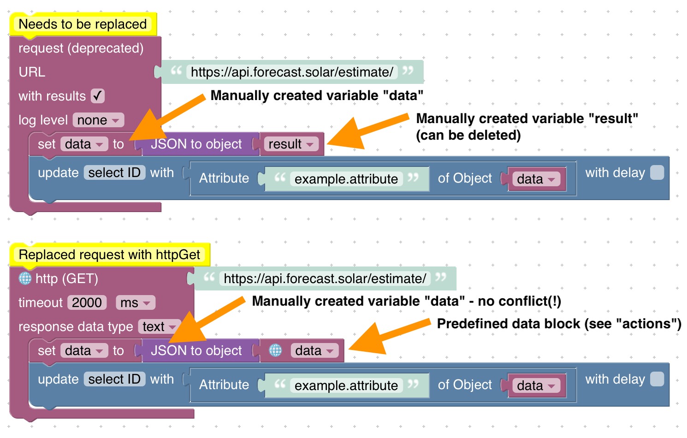

# Upgrade guide

## Forbidden directories for Script Filesystem Mirroring

**Since v5.5.0 of the JavaScript adapter** the following locations (relative to the ioBroker Base directory, usually `/opt/iobroker`) are not allowed to be used:
* The ioBroker base directory itself and any path above!
* `./iobroker-data` itself, custom subdirectory (choose a name that do not overlap with any adapter!)
* `./iobroker-data/backup-objects` or the anything below
* `./iobroker-data/files` or the anything below
* `./iobroker-data/backitup` or the anything below
* `./backups` or the anything below
* `./node_modules` or the anything below
* `./log` or the anything below

The script filesystem mirroring will store all source files of the Scripts in your file system and allows you to edit the files in your favorite script editor beside the web editor. All changes are synced in both directions.

When enabling the script files ystem mirroring, please make sure to create a **dedicated new directory** and **do not** use an existing directory with other content. Please also make sure that no other script or process changes files in the provided directory to prevent access issues.
Any location needs to be writable by the "iobroker" user!

## request to httpGet

**Since v8.0.0 of the JavaScript adapter** the `request` package is deprecated and the usage in your scripts will raise a warning. The JavaScript adpater needs to drop the package at some point. To make the migration as easy as possible, the sandbox provides new function to request HTTP ressources.

### JavaScript

Example code:

```js
const request = require('request');

schedule('*/30 * * * *', () => {
    const options = ;

    request({ url: 'https://api.forecast.solar/estimate/', method: 'GET' }, (error, response, body) => {
        if (!error && response.statusCode == 200) {
            const resObj = JSON.parse(body);

            // ...
        }
    });
});
```

Migration:

1. Remove the import of the `request` package
2. Use the native method `httpGet` (see documentation for details)
3. Update parameters of callback function
4. Replace `body` with `response.data`

```js
schedule('*/30 * * * *', () => {
    httpGet('https://api.forecast.solar/estimate/', (err, response) => {
        if (err) {
            console.error(err);
        } else if (response.statusCode == 200) {
            const resObj = JSON.parse(response.data);
 
            // ...
        }
    });
});
```

### Blockly

- The `request` block just supported HTTP GET (other methods were not supported) - replace the block with `http (GET)`
- It was required to create a custom variable named `result` to use the response. This is not required anymore. Delete the variable and use the dedicated block to work with the result parameters (like in trigger blocks).


